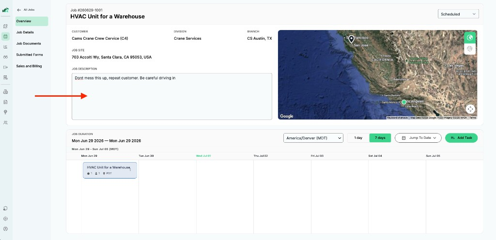
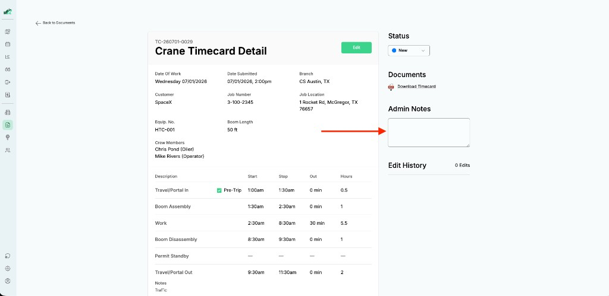

# PRD: @Mentions in Comments and Notes

## Problem

Field teams that use Ribbiot collaborate on jobs and documents (form submissions) throughout the workday. Today they can leave free-text notes on jobs and form submissions, but there is no way to direct someone's attention to a specific comment or note. Dispatchers miss updates buried in long note fields, and field workers have no reliable way to pull a colleague into a conversation.

We need **@mentions**: the ability to tag another user from anywhere a comment or note can be written, with notifications that deep-link back to the relevant job or document.

## Product context

These screenshots show where free-text notes exist in the Ribbiot web app today.

### Jobs

On a job overview page, the **Job Description** field is a free-text area for context about the work (stored as `notes` on the job). Dispatchers and field teams use it for handoff details, site cautions, and customer preferences.

### Documents

On a document detail page (here, a crane timecard), **Admin Notes** is a free-text area for internal comments about the submission (stored as `admin_notes` on the form submission). Similar note fields exist on other document types.

@mentions should work on surfaces like these, and on future dedicated comment threads.

## Personas

| Persona | Context |
|---------|---------|
| **Field worker** | Uses mobile apps (iOS/Android) with intermittent connectivity, often wearing gloves, sometimes in dim lighting. Needs quick @mention autocomplete and reliable offline queueing. |
| **Dispatcher** | Uses the web app to monitor jobs and documents. Needs to see mentions directed at them and jump directly to the source. |
| **Account admin** | Manages users, divisions, branches, and permissions. Needs confidence that mentions respect what each user is allowed to see. |

## User stories

1. **As a field worker**, I can type `@` in a comment or note on a job or form submission and see a list of colleagues I can mention, so I can quickly get someone's attention without leaving the app.

2. **As a dispatcher**, when someone @mentions me, I receive a notification that links directly to the job or document where I was mentioned, so I can respond without searching.

3. **As any user**, I only see mentions and comments on entities I have permission to access, so sensitive job or document data is never leaked through the mention system.

4. **As a user mentioned in a comment**, I can tap/click the notification and land on the exact job or document (with the comment in context if possible), so I understand why I was mentioned.

## Functional requirements

### Mention creation

- Users can @mention other people from **any surface where a comment or note can be written** (job notes, form submission notes, and future comment threads).
- Mention syntax supports at least `@displayName` and `@email` as input; the system resolves these to a user within the current **Account**.
- Only users belonging to the same Account can be mentioned (no cross-tenant mentions).
- The system stores mention metadata: who was mentioned, by whom, on which entity, and when.

### Permission awareness

- A user can only @mention users they are allowed to see within their Account (respect org structure and role-based permissions).
- A user can only **view** mentions and comments on jobs and documents they already have permission to access.

### Deep linking

- Notifications and in-app mention references must deep-link to:
  - **Jobs:** `/jobs/:jobId` (with optional anchor to the specific comment)
  - **Documents (form submissions):** `/documents/:documentId` (with optional anchor to the specific comment)
- Deep links must work on web and mobile clients (universal links / app links are acceptable patterns).

### Notifications (design only for this exercise)

- When a user is @mentioned, the system should enqueue a notification event.
- Email (SendGrid), push (APNs/FCM), and in-app notification channels are available infrastructure but **not yet wired** for this feature. Your design should describe how notifications would flow; full delivery implementation is out of scope.

## Given environment

Take the following as fixed constraints.

| Layer | Technology |
|-------|------------|
| Tenancy | Multi-tenant SaaS. Each customer is an **Account** with org structure (divisions, branches, crews) and role-based permissions. |
| Backend | Node/TypeScript services on AWS Lambda. Multiple services own different domains. |
| Database | PostgreSQL via Supabase (migrations, RLS, real-time). S3 for file blobs. |
| Auth | Auth0 on clients, JWT throughout the backend. |
| Async | SQS + Lambda consumers. Supabase real-time subscriptions available. |
| Email / Push | SendGrid, APNs (iOS), FCM (Android) — available but not yet wired for notifications. |
| Clients | React web, SwiftUI iOS, Jetpack Compose Android. |

### Service domain ownership

| Service | Owns |
|---------|------|
| **jobs-management-service** | Jobs, job-related entities |
| **time-card-service** | Forms, form templates, form submissions (documents) |
| **user-management-service** | Users, accounts, org structure, permissions |

## Current system (today)

There is **no comment thread or @mention model** in production today. Existing note fields are simple scalars:

| Surface | UI label | Field | Location |
|---------|----------|-------|----------|
| Jobs | Job Description | `notes` | `jobs` table (jobs-management-service) |
| Form submissions | Admin Notes | `admin_notes` | `form_submissions` table (time-card-service) |
| Form submissions | (varies) | `last_change_notes` | `form_submissions` table (time-card-service) |
| Audit trail | (varies) | `change_notes` | `form_submission_audit_log` table (Supabase) |

These are free-text fields with no parsing, no user resolution, and no notification hooks. The @mentions feature will likely require new data models and API surfaces rather than extending these columns in place, but that is a design decision for you to make.

### Data relationships

- Jobs live in the jobs-management-service domain.
- Form submissions (documents) live in the time-card-service domain and reference a job.
- User and permission data lives in the user-management-service domain.
- All of the above share the same Supabase Postgres instance. Row Level Security (RLS) enforces tenant and permission boundaries.

## Non-functional requirements

- **Multi-tenant isolation:** All mention data must be scoped to an Account. No cross-account data leakage at any layer.
- **Offline tolerance:** Mobile clients may compose mentions while offline. The design should address how mentions are queued and synced.
- **Service boundaries:** Respect domain ownership. Avoid tight coupling between services.
- **Auditability:** It should be possible to determine who mentioned whom, on what entity, and when.
- **Performance:** Mention autocomplete should feel instant on mobile (< 200 ms perceived latency on good connectivity).

Ask your interviewer if you need clarification on the platform during the session.
